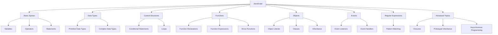

```mermaid
graph TD;
A[JavaScript] --> B[Basic Syntax]
A --> C[Data Types]
A --> D[Control Structures]
A --> E[Functions]
A --> F[Objects]
A --> G[Events]
A --> H[Regular Expressions]
A --> I[Advanced Topics]

B --> B1[Variables]
B --> B2[Operators]
B --> B3[Statements]

C --> C1[Primitive Data Types]
C --> C2[Complex Data Types]

D --> D1[Conditional Statements]
D --> D2[Loops]

E --> E1[Function Declarations]
E --> E2[Function Expressions]
E --> E3[Arrow Functions]

F --> F1[Object Literals]
F --> F2[Classes]
F --> F3[Inheritance]

G --> G1[Event Listeners]
G --> G2[Event Handlers]

H --> H1[Pattern Matching]

I --> I1[Closures]
I --> I2[Prototypal Inheritance]
I --> I3[Asynchronous Programming]
```
