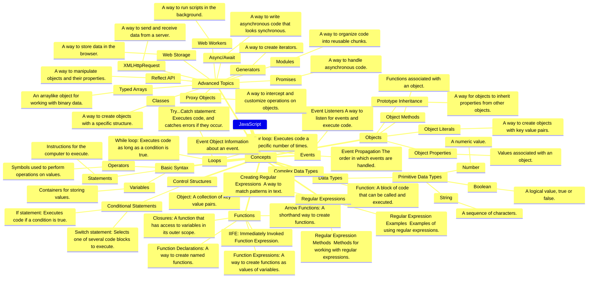

```mermaid
mindmap
JavaScript
  Concepts
    Basic Syntax
      Variables
        Containers for storing values.
      Operators
        Symbols used to perform operations on values.
      Statements
        Instructions for the computer to execute.
    Data Types
      Primitive Data Types
        String 
          A sequence of characters.
        Number
          A numeric value.
        Boolean
          A logical value, true or false.
    Complex Data Types
      Object: A collection of key value pairs.
      Function: A block of code that can be called and executed.
    Control Structures
      Conditional Statements
        If statement: Executes code if a condition is true.
        Switch statement: Selects one of several code blocks to execute.
    Loops
        For loop: Executes code a specific number of times.
        While loop: Executes code as long as a condition is true.
        Try...Catch statement: Executes code, and catches errors if they occur.
    Functions
      Function Declarations: A way to create named functions.
      Function Expressions: A way to create functions as values of variables.
      Arrow Functions: A shorthand way to create functions.
      IIFE: Immediately Invoked Function Expression.
      Closures: A function that has access to variables in its outer scope.
    Objects
      Object Literals
        A way to create objects with key value pairs.
      Object Properties
        Values associated with an object.
      Object Methods
        Functions associated with an object.
      Prototype Inheritance
        A way for objects to inherit properties from other objects.
    Events
      Event Listeners A way to listen for events and execute code.
      Event Propagation The order in which events are handled.
      Event Object Information about an event.
    Regular Expressions
      Creating Regular Expressions  A way to match patterns in text.
      Regular Expression Methods  Methods for working with regular expressions.
      Regular Expression Examples  Examples of using regular expressions.
    Advanced Topics
      Classes
        A way to create objects with a specific structure.
      Modules
        A way to organize code into reusable chunks.
      Promises
        A way to handle asynchronous code.
      Async/Await
        A way to write asynchronous code that looks synchronous.
      Generators
        A way to create iterators.
      Proxy Objects
        A way to intercept and customize operations on objects.
      Reflect API
        A way to manipulate objects and their properties.
      Typed Arrays  
        An arraylike object for working with binary data.
      Web Workers
        A way to run scripts in the background.
      Web Storage
        A way to store data in the browser.
      XMLHttpRequest
        A way to send and receive data from a server.
```